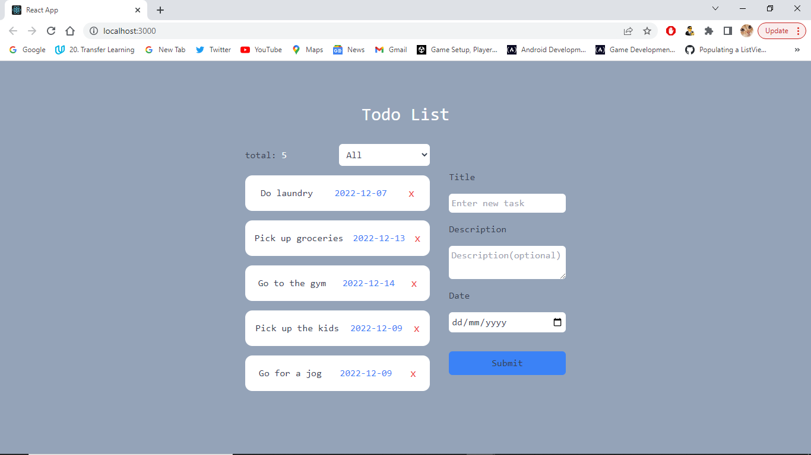

# Frontend Mentor - Kreatix Technology todo list app solution

## Table of contents

- [Overview](#overview)
  - [Screenshot](#screenshot)
  - [Links](#links)
- [My process](#my-process)
  - [Built with](#built-with)
- [Author](#author)
- [Acknowledgments](#acknowledgments)

## Overview

### Screenshot

### Links

- Solution URL: [Github](https://github.com/Dbest2018/Todos-KreatixTech)
- Live Site URL: [live site](https://github.com/Dbest2018/Todos-KreatixTech)

## My process

### Built with

- Semantic HTML5 markup
- CSS custom properties
- Flexbox
- Mobile-first workflow
- [React](https://reactjs.org/) - JS library
- [Tailwind](https://tailwindcss.com/) - For styles
- [Firebase](https://firebase.com) - For backend

## Author

- Website - [Portfolio](https://iam-ibrahim.netlify.app)
- Twitter - [@iamDbest20](https://www.twitter.com/iamDbest20)
